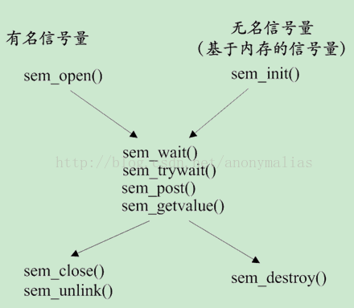
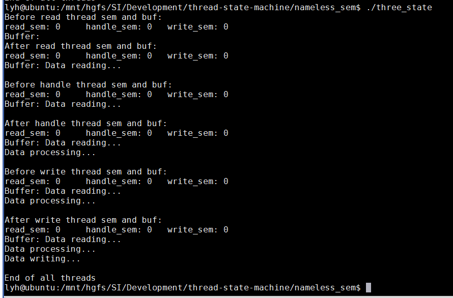

# thread-state-machine
一个三线程循环同步的三状态机
 *  使用无名信号量实现三线程循环同步状态机
 * 模拟 取数据->处理数据->输出数据


```c
sem_t r=1,h=0,w=0;
```

read thread:    |   handle thread:   |  write thread:
-------|-------------|-----------
P(r)     |  P(h)       | P(w)      
read()   |  handle()   | write()
V(h)     |   V(w)      |  V(r)

## POSIX信号量简介

## 无名信号量运行结果
